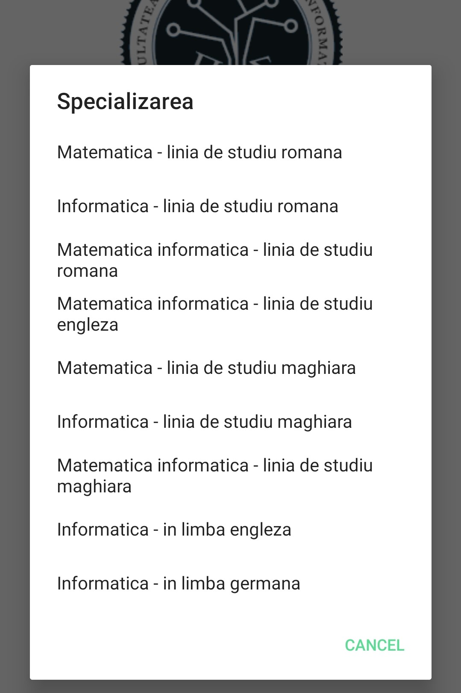
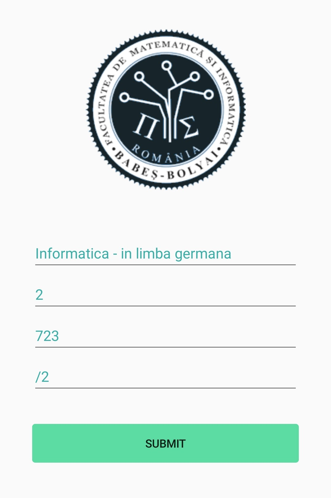
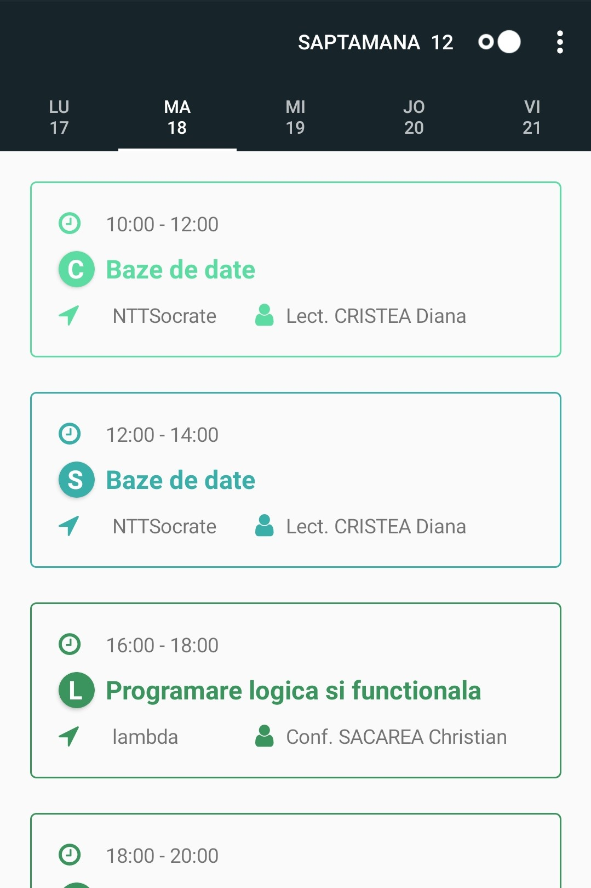
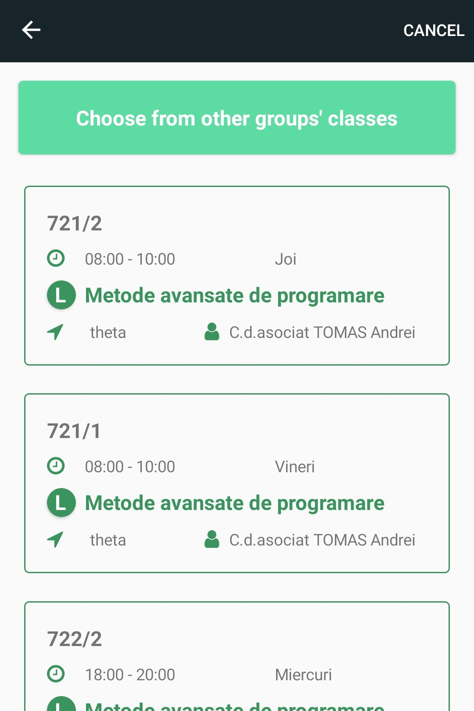

# CS Times

🗓️ Cross-platform Xamarin Forms application to help students at UBB keep track of their timetable.

## Getting started

Meet CS Times - the perfect timetable app for the students of The Faculty of Mathematics and Computer Science of the Babes-Bolyai University.

Forget about having to search for your timetable online and select classes you have to attend. Let CS Times do the work for you - Just give it the name of your study programme and group and it will extract your custom timetable.

[Download CS Times from Google Play](https://play.google.com/store/apps/details?id=com.companyname.SetUp)

## Features

* Extracts schedule based on the information the user provides about his study programme.

 

* Filteres classes to show only those that belong to the user's group, as well as the current week.

* The user can edit a class by changing its day and/or time, or pick from the list of classes belonging to other groups.

* Information entered by the user will be saved, so the authentification will only be needed once. The user can log out when he chooses.

* The app needs an active connection to the internet, as the timetable data is fetched in real time.
